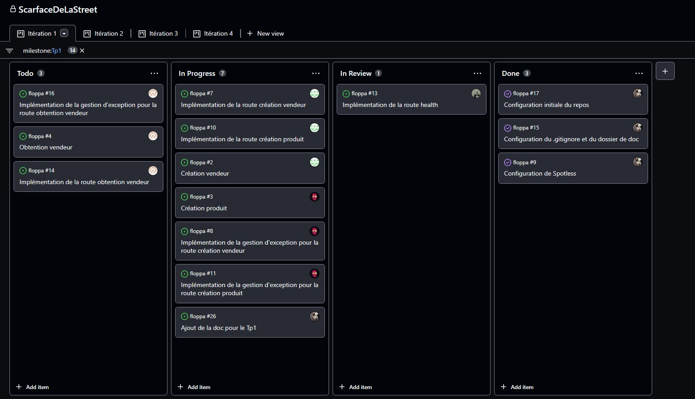
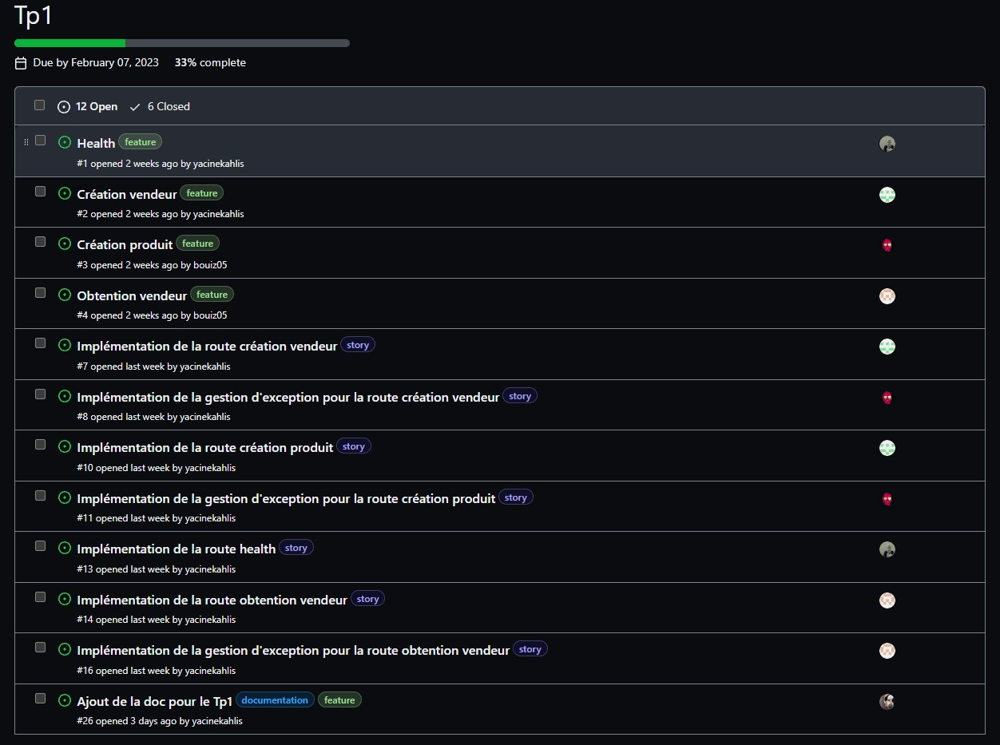
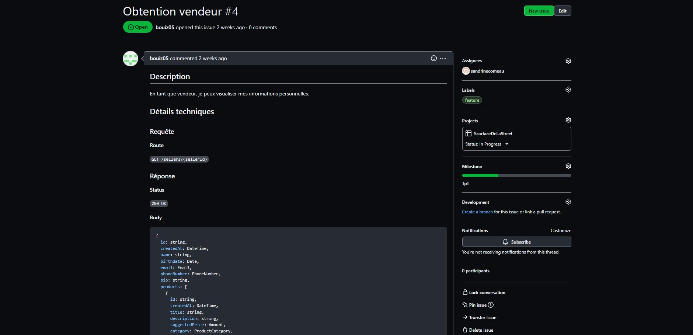
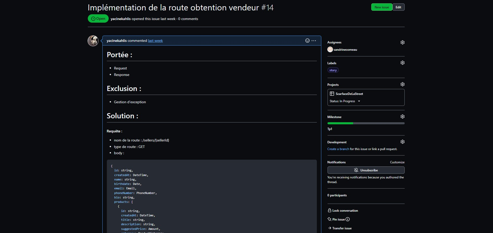
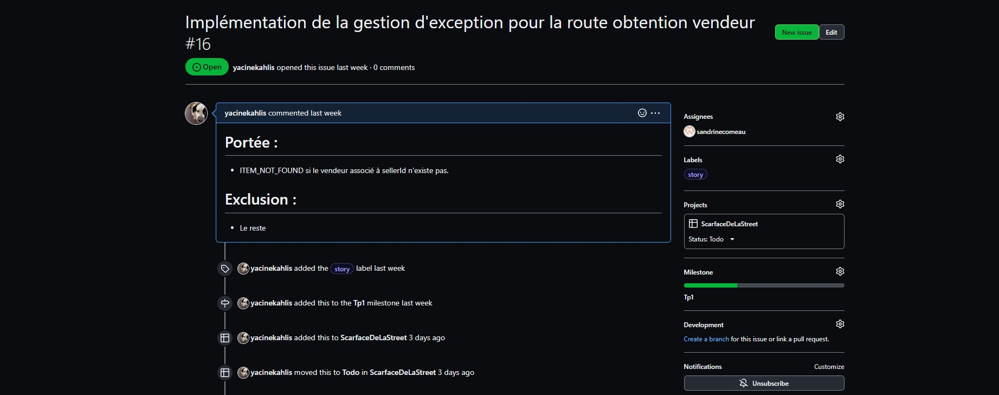
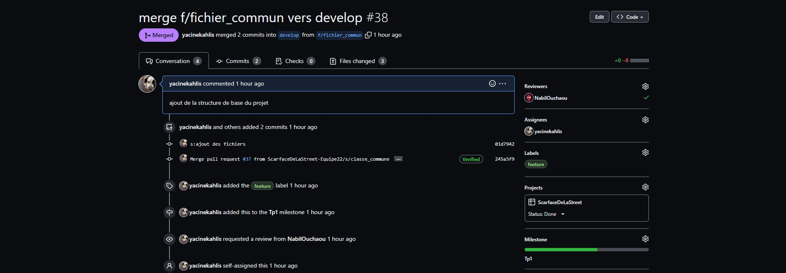
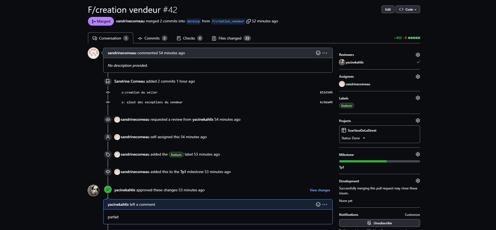
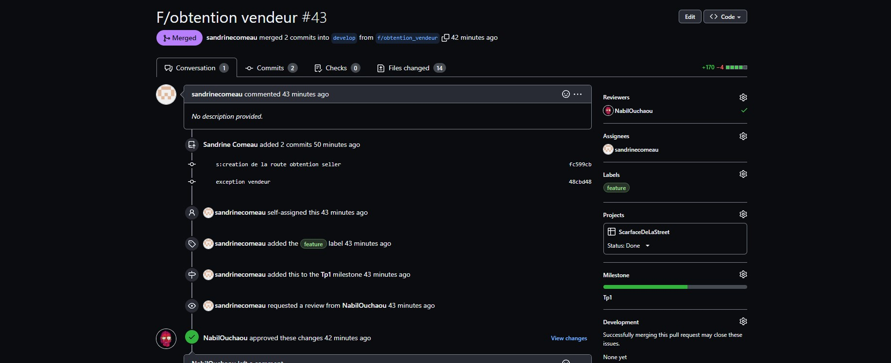
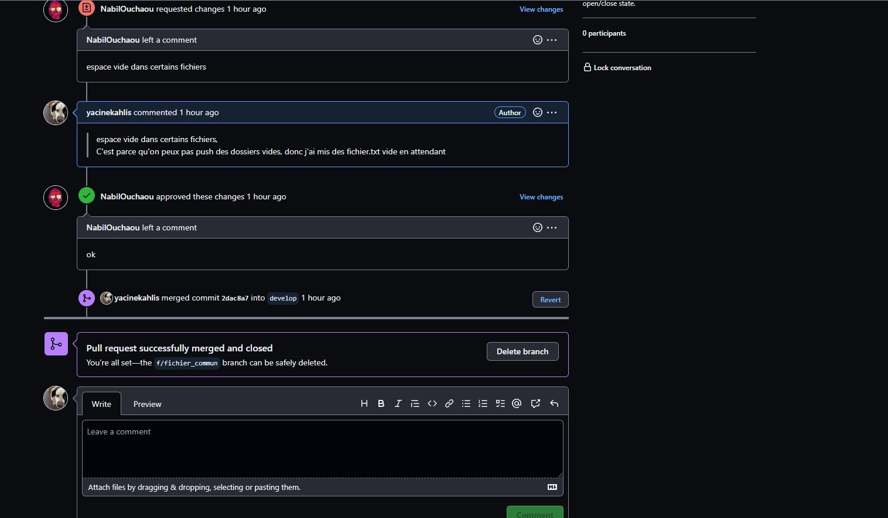
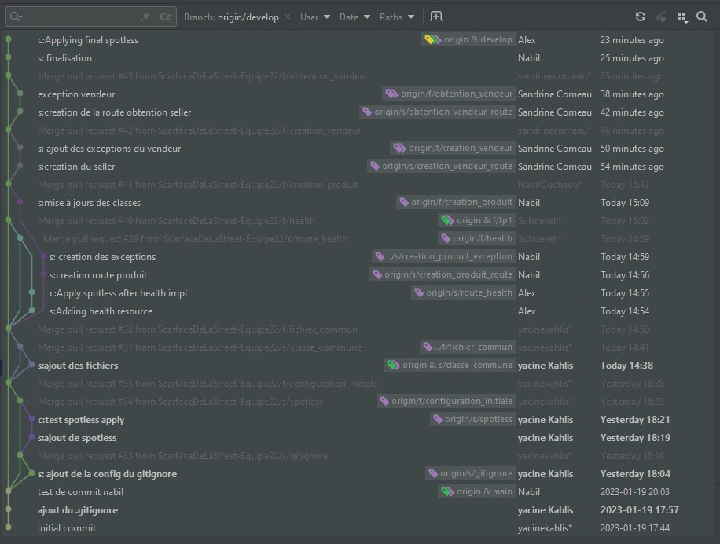

# TP1

# Planification du travail sur Github

## Github Project
### Présentation claire des étapes du processus
Pour suivre l’avancement des issues, Github Project sera utilisé.
Dans cet outil, il est possible d’indiquer l’avancement des différents issues.
Il y a quatre catégories dans lesquelles
une issue peut être : Ready, In Progress, In review, Done.
De plus, il y a quatre différentes vues du tableau : une pour chaque itération.

### Présence de l'ensemble des issues dans les bonnes colonnes
Dans la capture d'écran ci-dessous, on observe l'avancement des tâches selon leur statut.

### Screenshots

  

## Milestone
L'équipe a créé 4 milestones pour mener le projet à bien : un pour chaque Tp.
Chaque issue doit être associé à un milestone, ainsi, dans la section milestone, l'équipe peut facilement suivre l'avancement des tâches.
### Screenshots

  

## Issues
Chaque tâche est représentée par une issue. Chaque issue a été déterminée en équipe.
De plus, pour une meilleure séparation du travail à faire, chaque fonctionnalité est représentée en issue et est liée à un label nommé feature.
Chaque issue de type feature est redécoupée en d'autres issues qui sont associées à des labels story.
Grâce à cette séparation issue, il devient facile de suivre notre stratégie de branching. Il suffit de merge toutes les branches story dans celle de la feature.
Toutes les issues se retrouvent dans le gitProject.
### Screenshots

  

  

  

## Pull requests
Voici quelques exemples de pull request. La dernière contient un exemple de revue de code.
### Screenshots

  

  

  

  

## Arbre de commits
Voici l'historique de notre branche develop.
### Screenshots

  

## Fichiers ignorés
Notre fichier .gitignore ignore tous les fichiers de configurations personnelles, ceux qui contiennent des paths personnelles et
les fichiers autogénérés (par java et intelliJ). Le fichier est principalement fait à partir d'un dépôt git collaboratif qui discute des fichiers gitignore. https://gist.github.com/dedunumax/54e82214715e35439227

## Stratégie de commit
1. Voici la nomenclature  des commits que l'équipe à choisi : `type : message`. Voici un exemple : s:"ajout de la classe Product". Les types de commits sont : story (s), clean code (c) et documentation (d).
2. On commit lorsque le travail effectué pour la branche est terminé, puis on fait un dernier commit de clean code.

## Stratégie de branchage
1. Les branches de base sont main et develop. Main est la branche principale, elle contient le code officiel pour chaque remise. Il y a aussi la branche develop qui contient nos branches features. La branche sert principalement à tester le code regroupé avant de tout mettre dans la branche main.
2. La branche principal est main.
3. L'équipe a choisi de s'inspirer de Git Flow pour sa stratégie de branching.
   Chaque branche est reliée à une issue.
   Voici la nomenclature  des branches : `type d'issue/nom de l'issue`.
   Les types d'issue sont feature (f) ou story (s).
   Voici un exemple de deux branches: f/creation_vendeur et s/creation_vendeur_route.
   On crée une branche à chaque fois qu'on veut travailler sur une issue.
4. Les branches de story vers celle de la feature n'ont pas besoin d'être des pull request (pas de revue de code). En revanche, les merge de feature vers develop doivent nécessairement passer par une pull request et doivent être revue par au moins une personne. Même chose pour les merge de develop vers la branche main.

