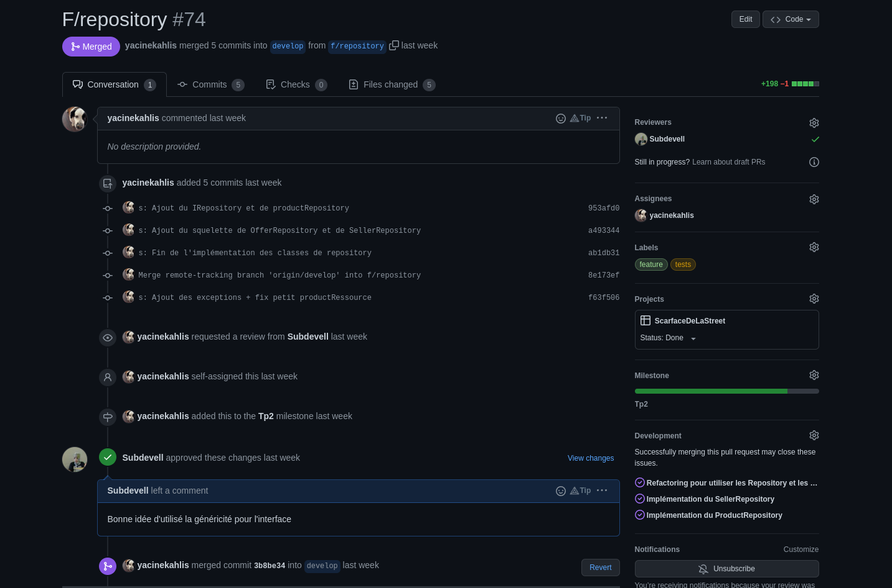
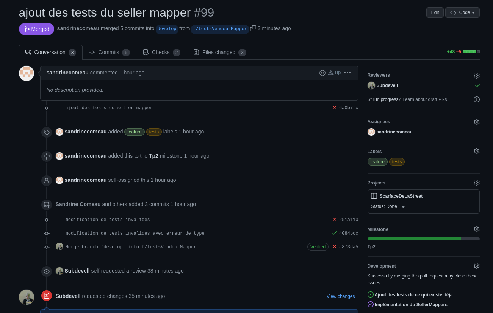

# TP2

# Planification du travail sur Github

## Github Project
Dans la capture d'écran ci-dessous, on observe l'avancement des tâches selon leur statut.

### Screenshots

  

## Milestone
Voici la milestone TP2 ainsi que ses issues liée
### Screenshots

  

## Issues
Voici quelques exemples d'issues
### Screenshots

  

  

  

## Pull requests
Voici quelques exemples de pull request.
### Screenshots

  

  

  

## Arbre de commits
Voici l'historique de notre branche develop.
### Screenshots

  

