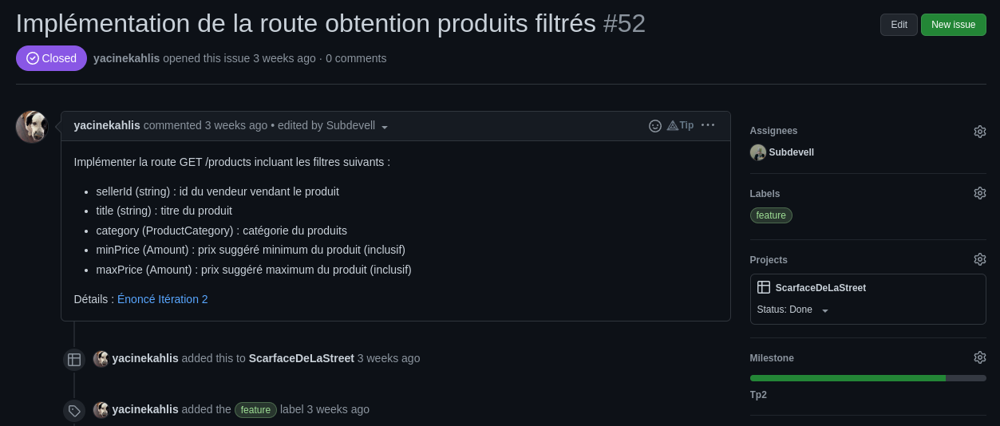

# TP2

# Restrospective

## Métriques

### Combien de temps (moyenne, minimum, maximum) votre équipe prenait-elle pour implémenter une issue?

Min : 20m, Max : 4h, Moy : 2h

### Combien de temps (moyenne, minimum, maximum) votre équipe prenait-elle pour intégrer une pull-request? (review + correctifs)

Min : 5m, Max : 1/2 journée, Moy : 30m

### Combien de personnes (moyenne, minimum, maximum) travaillaient sur chaque issue? (individuel, paire, équipe, etc.)

Min : 1, Max : 3, Moy : 1

### Combien de personnes (moyenne, minimum, maximum) reviewaient chaque pull-request?

Min : 1, Max : 1, Moy : 1

### Combien d'issue (moyenne, minimum, maximum) étaient en cours d'implémentation en même temps?

Min : 0, Max : 5, Moy : 5

### Combien de pull-requests (moyenne, minimum, maximum) étaient en cours de review en même temps?

Min : 0, Max : 2, Moy : 1

## Analyse

### Selon vous, est-ce que les issues/pull-requests prenaient trop de temps à être terminées? Ou pas assez?

En général, nos issues nous prenais raisonnable de travail.
Certaines tâches étaient très simples et donc rapide, comme la route Health, mais on peut difficilement allonger ces issues sans les lier à des tâches n'ayant aucun rapport.

Par contre, quelques tâches ont pris beaucoup plus de temps à cause d'oublie lors de la séparation des tâches (Oublier de créer des classes prérequises, par exemple)

### Quel serait le temps idéal (approximatif) pour chacun?

Idéalement, chaque issue principale devrait durer entre 1 et 2h. 
Bien sûr, certaines issues plus secondaires (comme les fix de bugs) pourraient prendre beaucoup moins de temps.

### Quel est le lien entre la taille de ces issues/pull-requests et le temps que ça prenait à les terminer?

Plus une issue est grande, plus elle prendra de temps à faire. Il y aura plus de réflexion, plus de lignes à écrire et plus de bugs à régler.
De plus, plus une issue est grande, plus il faudra l'attendre si une de ses tâches est une dépendence d'une autre issue.

### Donnez au moins 3 trucs pour améliorer votre processus (tailles des issues/pr, communication, code reviews, uniformisation, etc.)

- Avant de créer une issue, s'assurer de bien comprendre tout ce qui est nécessaire pour l'accomplir
- Mieux subdiviser les tâches afin qu'elle corresponde à notre temps idéal de 1 à 2h
- Simplifier notre statégie de branchage qui était trop complexe pour nos besoins
- Être plus disponible et réactif sur notre Discord afin de pouvoir mieux coopérer

# Diagramme de classe

  

# Planification du travail sur Github

## Github Project
Dans la capture d'écran ci-dessous, on observe l'avancement des tâches selon leur statut.

### Screenshots

  

## Milestone
Voici la milestone TP2 ainsi que ses issues liée
### Screenshots

  

## Issues
Voici quelques exemples d'issues
### Screenshots

  

  

  

## Pull requests
Voici quelques exemples de pull request. La dernière comprend aussi un exemple code-review
### Screenshots

  

  

  

  

## Arbre de commits
Voici l'historique de notre branche develop.
### Screenshots

  

# Analyse de formattage
Vérifier le formattage du code : `mvn spotless:check`
 
Appliquer le formattage du code : `mvn spotless:apply`

